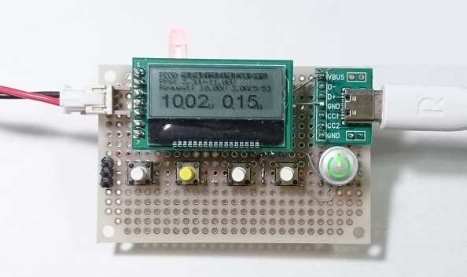

# STM32 USB-PD Power
A simple USB Type-C/USB-PD sink device using STM32G071KBT8N.

## Features
* PD sink device
* Output adjustable high voltage / current from USB-PD sink
* Show voltage and current on graphical LCD
* Whether souce supports PPS or not is showed on LED
* One Type-C connector
* Supports USB-PD v3 PPS(Programmable Power Source).
* Switch output ON/OFF
* Adjust output voltage in 20mV step (PPS mode)

## Requirement
Project is for STM32CubeIDE. 
IDE project files are generated by STM32CubeMX.

## Schematics
See pdf file.

## Author
* Eleken
* https://eleken.y-lab.org
