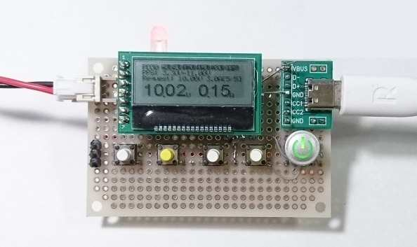

# STM32 USB-PD Power
A simple USB Type-C/USB-PD sink device using STM32G071KBT8N.

- Switch: SW5(Lock), SW4(PDO/Pout) SW3(-) SW2(+) SW1(Power) from left to right
- SW1: long push to toggle output ON/OFF
- SW2,3: adjust output voltage

## Features
* PD sink device
* Adjustable high voltage / current from USB-PD sink
* Show voltage and current on graphical LCD
* LED status shows whether souce supports PPS
* One Type-C connector
* Supports USB-PD v3 PPS(Programmable Power Source)
* Switch output ON/OFF
* Adjust output voltage in 20mV step (PPS mode)
* Store PPS voltage at EEPROM and restore when it is powered

## Requirement
Project is for STM32CubeIDE. 
IDE project files are generated by STM32CubeMX.

## Schematics
See pdf file.

## Article
For more details, ee transistor gijutsu Sep. 2023.

## Author
* Eleken
* https://eleken.y-lab.org
